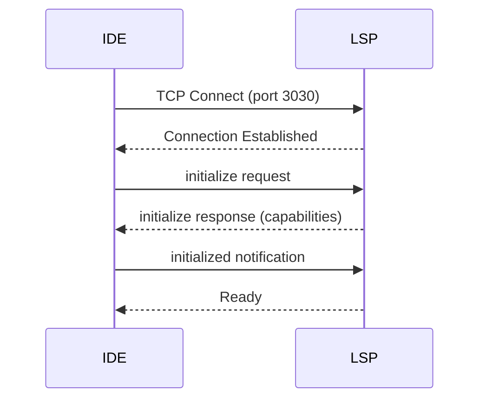
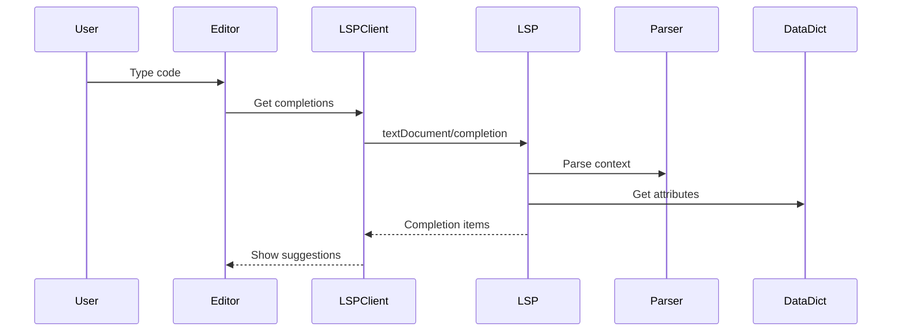
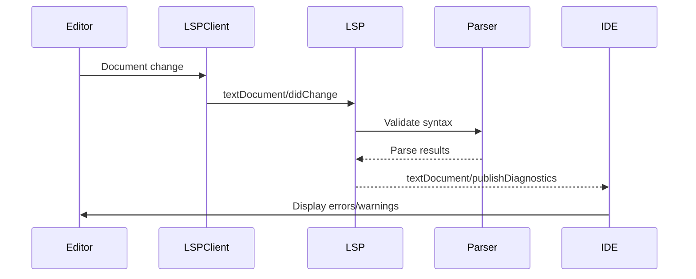

# LSP Integration Guide

## Architecture Overview

The Data Designer Language Server Protocol (LSP) implementation provides professional IDE features for DSL development. Here's how the components integrate:

```
┌──────────────────────────────────────┐
│         Web IDE (ide.html)           │
│  • Monaco Editor                     │
│  • LSP Client (lsp-client.js)        │
└────────────┬─────────────────────────┘
             │ TCP Protocol
             │ Port 3030
┌────────────▼─────────────────────────┐
│    DSL Language Server (Rust)        │
│    dsl-lsp-server                    │
├──────────────────────────────────────┤
│  • tower-lsp framework               │
│  • nom parser integration            │
│  • Data Dictionary (KYC domain)      │
│  • AI Agent interfaces               │
│  • Diagnostic engine                 │
└──────────────────────────────────────┘
```

## Component Integration

### 1. Language Server (Backend)

**Location**: `dsl-lsp/src/`

**Key Files**:
- `lib.rs` - Main LSP implementation with tower-lsp
- `data_dictionary.rs` - KYC domain model
- `ai_agent.rs` - AI integration (Gemini/Copilot)
- `main.rs` - Server entry point

**Features Implemented**:
- ✅ Text document synchronization
- ✅ Completion provider (IntelliSense)
- ✅ Hover provider (tooltips)
- ✅ Diagnostic provider (error detection)
- ✅ Semantic tokens (syntax highlighting)
- ✅ Code actions (AI explanations)
- ✅ Execute commands (data dictionary loading)

### 2. IDE Client (Frontend)

**Location**: `src/`

**Key Files**:
- `ide.html` - Main IDE interface
- `lsp-client.js` - LSP client implementation
- `dsl-language.js` - Monaco language definition

**Integration Points**:

1. **Editor Initialization**:
```javascript
editor = monaco.editor.create(element, {
    language: 'dsl',
    theme: 'dsl-dark'
});
```

2. **LSP Connection**:
```javascript
const lspClient = new LSPClient('ws://localhost:3030');
await lspClient.connect();
```

3. **Document Synchronization**:
```javascript
// Open document in LSP
await lspClient.openDocument(uri, 'dsl', 1, editor.getValue());

// Update on changes
editor.onDidChangeModelContent(() => {
    lspClient.changeDocument(uri, version++, editor.getValue());
});
```

4. **IntelliSense Integration**:
```javascript
monaco.languages.registerCompletionItemProvider('dsl', {
    async provideCompletionItems(model, position) {
        const completions = await lspClient.getCompletions(
            uri,
            position.lineNumber - 1,
            position.column - 1
        );
        return { suggestions: completions };
    }
});
```

5. **Diagnostics Display**:
```javascript
lspClient.onDiagnostics((uri, diagnostics) => {
    const markers = diagnostics.map(d => ({
        startLineNumber: d.range.start.line + 1,
        startColumn: d.range.start.character + 1,
        endLineNumber: d.range.end.line + 1,
        endColumn: d.range.end.character + 1,
        message: d.message,
        severity: mapSeverity(d.severity)
    }));
    monaco.editor.setModelMarkers(editor.getModel(), 'dsl', markers);
});
```

## Data Flow

### 1. Initialization Sequence



### 2. Code Completion Flow



### 3. Diagnostics Flow



## Running the Integration

### 1. Start the Language Server

```bash
# Build if needed
cd dsl-lsp
cargo build --release

# Run in TCP mode
./target/release/dsl-lsp-server tcp --port 3030

# Or with verbose logging
./target/release/dsl-lsp-server tcp --port 3030 --verbose
```

### 2. Start the IDE

```bash
# Option 1: Open directly in browser
open src/ide.html

# Option 2: Via Tauri app
npm run tauri dev
```

### 3. Connect IDE to LSP

1. Click "Connect LSP" button in IDE
2. Wait for "Connected" status
3. Start typing DSL code
4. IntelliSense and diagnostics should work automatically

## Testing the Integration

### Manual Testing

1. **Test Completions**:
   - Type `IF ` and see THEN suggestion
   - Type `IS_` and see validation functions
   - Type `Client.` and see attributes

2. **Test Diagnostics**:
   - Type `IF without THEN` - should show error
   - Type invalid syntax - should highlight

3. **Test Hover**:
   - Hover over `IS_EMAIL` - should show description
   - Hover over operators - should show explanations

### Automated Testing

Run the test script:
```bash
./test-lsp.sh
```

## Troubleshooting

### Common Issues

1. **LSP won't start**:
   - Check port 3030 is not in use: `lsof -i:3030`
   - Kill existing process: `kill $(lsof -t -i:3030)`

2. **IDE can't connect**:
   - Verify LSP is running: `ps aux | grep dsl-lsp`
   - Check firewall settings for port 3030
   - Try stdio mode instead of TCP

3. **No completions showing**:
   - Check browser console for errors
   - Verify LSP initialization completed
   - Check network tab for WebSocket/TCP traffic

4. **Diagnostics not updating**:
   - Ensure document is opened in LSP
   - Check LSP logs for parse errors
   - Verify parser module is exported correctly

### Debug Commands

```bash
# Check if LSP is listening
netstat -an | grep 3030

# Watch LSP logs
RUST_LOG=debug ./dsl-lsp/target/release/dsl-lsp-server tcp

# Test LSP with curl (basic check)
echo '{"jsonrpc":"2.0","method":"initialize","id":1,"params":{}}' | \
  nc localhost 3030
```

## Extending the Integration

### Adding New LSP Features

1. **In Backend** (`lib.rs`):
```rust
async fn definition(&self, params: GotoDefinitionParams) -> Result<Option<GotoDefinitionResponse>> {
    // Implementation
}
```

2. **In Frontend** (`lsp-client.js`):
```javascript
async getDefinition(uri, line, character) {
    return await this.sendRequest('textDocument/definition', {
        textDocument: { uri },
        position: { line, character }
    });
}
```

3. **In IDE** (`ide.html`):
```javascript
monaco.languages.registerDefinitionProvider('dsl', {
    async provideDefinition(model, position) {
        const result = await lspClient.getDefinition(...);
        // Convert to Monaco format
    }
});
```

### Adding AI Features

1. Configure AI agent in LSP:
```rust
backend.set_ai_agent("gemini", Some(api_key)).await?;
```

2. Use AI commands:
```javascript
await lspClient.executeCommand('dsl.explainRule', [uri]);
await lspClient.executeCommand('dsl.optimizeRule', [uri]);
```

## Performance Considerations

- **Parser Caching**: Parse results are cached per document
- **Incremental Updates**: Only changed portions are re-parsed
- **Async Operations**: All LSP operations are non-blocking
- **Connection Pooling**: Single TCP connection for all operations

## Security Notes

- LSP runs on localhost only by default
- No authentication required for local development
- For production, use TLS and authentication
- Sanitize all user input before parsing

---

This integration provides a professional development experience for DSL with full IDE features powered by the Language Server Protocol.